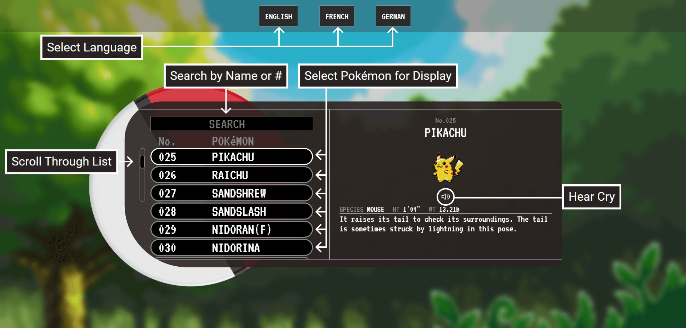
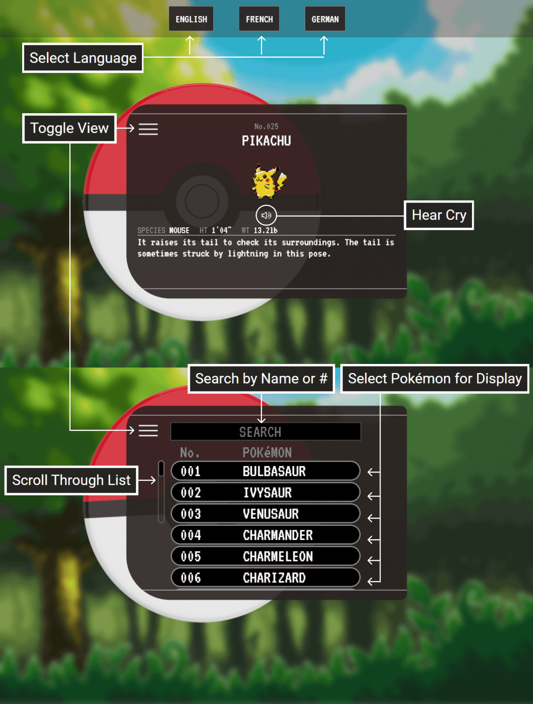

# PokéLex React

> A rewrite of [PokéLex](https://github.com/zshawdev/pokelex) using React, TypeScript, and Tailwind CSS.

## PokéLex

PokéLex ("Pokédex" + "lexicon") is a website that combines an immersive language-learning approach with the universally-loved, multimedia sensation that is Pokémon. Practice your foreign language skills by learning about the world's favorite mythical creatures via this interactive, multilingual encyclopedia!
<p align="center" width="100%">
     
</p>

## ⚙ Features

* Interactive user interface
* English, French and German display modes
* Search filter, by name (language-agnostic) or ID number
* Day-night cycle, displays different backgrounds matching your current real-life sunrise-sunset cycle

## 🏗 Built With

* [Node.js](https://nodejs.org/en/) - Open-source, cross-platform, back-end JavaScript runtime environment
* [TypeScript](https://www.typescriptlang.org/) - Strongly-typed programming language that builds on JavaScript
* [Express](https://expressjs.com/) - Minimalist web framework for Node.js
* [React](https://reactjs.org/) - JavaScript library for building rich user interfaces
* [TailwindCSS](https://tailwindcss.com/) - Utility-first CSS framework

## Project Structure

```md
📦pokelex-react
 ┣ 📂pokelex-react-client 
 ┃  ┣ 📙webpack.config.js  }
 ┃  ┣ 📙postcss.config.js  }--> # config for various bundler/post-processing tools
 ┃  ┣ 📙tailwind.config.js }
 ┃  ┣ 📙babel.config.js    }
 ┃  ┣ 📂public   # all assets loaded on the client (images, manifest, etc)
 ┃  ┗ 📂src
 ┃     ┣ 📂components # base components that can be reused throughout the application            
 ┃     ┣ 📂hooks      # hooks that (for right now) store mostly context objects
 ┃     ┣ 📂layout     # components that strictly handle application structure/layout
 ┃     ┣ 📂utils
 ┃     ┣ 📘api.ts       # server application interaction
 ┃     ┣ 📔[clear.css, index.css] # base imported css styles
 ┃     ┣ ⚛️App.tsx      # Application entry point
 ┃     ┣ ⚛️index.tsx    # bootstrap
 ┃     ┗ 📄index.html   # template for HtmlWebpackPlugin
 ┃
 ┣ 📂server 
 ┃  ┣ 📂[cries, images]  # static assets that are served from the server
 ┃  ┣ 📘app.ts           # base route logic
 ┃  ┣ 📘config.ts        # environment variable extraction
 ┃  ┣ 📘index.ts         # server entry point
 ┃  ┣ 📘pokeapi.ts       # pokeapi.co interaction and transformation
 ┃  ┗ 📘utils.ts
 ┃ 
 ┗ 📜custom.d.ts  # holds all global type declarations used in both client and server
```

## Prerequisites

* [Node.js](https://nodejs.org/en/download/) version 16+

## Getting Started

```bash
npm install
# Followed by
npm start
```

That's it!

## 📸 Screenshots

PokéLex boasts a slick interface and parallels many of the functionalities of the actual Pokédex device as featured throughout the famous video game series:
<p align="center" width="100%">
     
     
</p>

## 🛣 Roadmap

* Spanish, Italian and Japanese as language options
* Options for choosing additional information per Pokémon
* Expand Pokémon list to all current Pokémon
* Additional Pokédex features (world locations, evolutions, additional search sorts and filters)
* Auto-generated TypeScript interfaces for data from PokéAPI
* Containerize application for deployment anywhere

## TODOS  
> Created using `generate-todo.js`

- custom.d.ts:61: make the versions object here its own auto-generated interface
- server/app.ts:18: make this recurse properly instead of putting the entire thread to sleep
- server/pokeapi.ts:107: build out a better way to emit when `getPokemonList` finishes and resolve that here
- server/pokeapi.ts:129: make this language agnostic and map all localizations for the name/ species/ entry keys
- server/__tests__/api.test.ts:3: simplify startup time so this can be lower

## Acknowledgements

* [sunrise-sunset](https://github.com/udivankin/sunrise-sunset/blob/master/src/index.ts) - Day/night functionality
* [loading-io](https://loading.io/) - Loading icon
* [Ibrahim Saberi](https://github.com/GeorgeIpsum) - `generate-todo-js` creator and coding mentor
